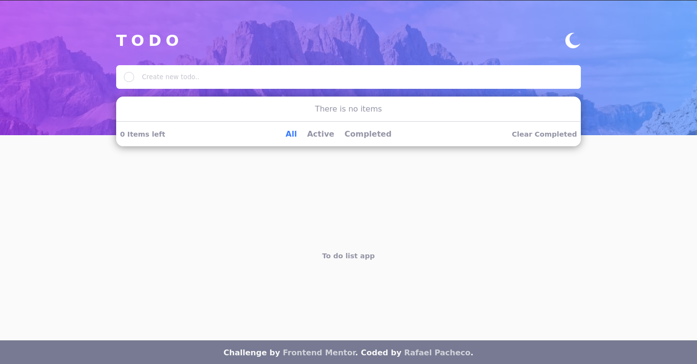

# Frontend Mentor - Todo app solution

This is a solution to the [Todo app challenge on Frontend Mentor](https://www.frontendmentor.io/challenges/todo-app-Su1_KokOW). Frontend Mentor challenges help you improve your coding skills by building realistic projects. 

## Table of contents

- [Overview](#overview)
  - [The challenge](#the-challenge)
  - [Screenshot](#screenshot)
  - [Links](#links)
- [My process](#my-process)
  - [Built with](#built-with)
  - [What I learned](#what-i-learned)
- [Author](#author)

## Overview

### The challenge

Users should be able to:

- View the optimal layout for the app depending on their device's screen size
- See hover states for all interactive elements on the page
- Add new todos to the list
- Mark todos as complete
- Delete todos from the list
- Filter by all/active/complete todos
- Clear all completed todos
- Toggle light and dark mode
- **Bonus**: Drag and drop to reorder items on the list

### Screenshot

### Links

- Solution URL: [Solution](https://github.com/rafa64H/todo-app)
- Live Site URL: [The live site](https://rafa64h.github.io/todo-app/)

## My process

### Built with

- HTML5
- CSS
- Flexbox
- Mobile-first workflow
- Javascript ES6

### What I learned

I have more undestanding on javascript classes and modules, also I learned how to write event listeners that supports the creation of new elements

## Author

- Frontend Mentor - [@rafa64H](https://www.frontendmentor.io/profile/rafa64H)
